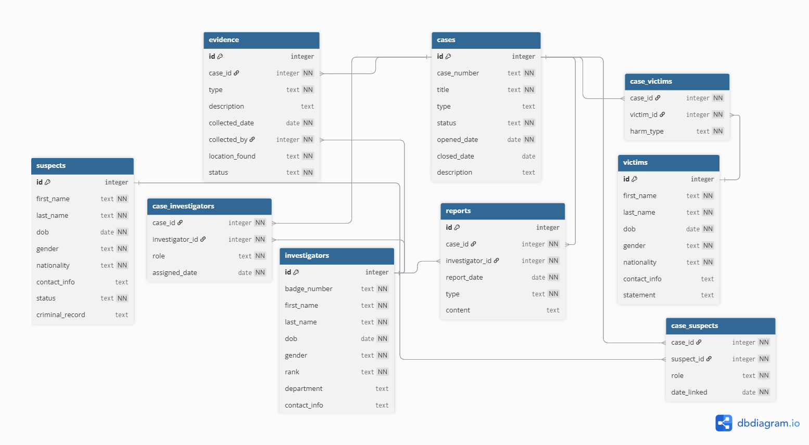

# Design Document

By Harsini Jegatheesan

Video overview: <URL HERE>

## Scope

### Purpose
The purpose of this database is to manage and track criminal cases,
including the suspects, victims, investigators, evidence, and reports
associated with each case. It is designed to simulate a real-world
law enforcement case management system.

### In Scope
* **Cases** — criminal cases with their type, status, and dates
* **Suspects** — individuals linked to cases with their personal
info and criminal history
* **Victims** — individuals harmed in cases with their statements
* **Investigators** — law enforcement officers assigned to cases
* **Evidence** — physical, digital, and forensic items collected
* **Reports** — incident, progress, forensic, and closing reports

## Functional Requirements

### What a user can do
* Add, view, and manage criminal cases and their current status
* Link suspects, victims, and investigators to specific cases
* Track evidence collected for each case and its current status
* File and retrieve reports for any case
* Query repeat offenders, unsolved cases, and case summaries
* View open cases with their lead investigator and suspect count

## Representation

### Entities

#### Cases
The `cases` table represents criminal cases with the following attributes:
* `id` — INTEGER PRIMARY KEY, uniquely identifies each case
* `case_number` — TEXT NOT NULL UNIQUE, official reference number
* `title` — TEXT NOT NULL, short descriptive name of the case
* `type` — TEXT with CHECK constraint limiting to Murder, Robbery,
Fraud, Assault, Kidnapping, or Other
* `status` — TEXT NOT NULL with DEFAULT 'Open' and CHECK constraint
limiting to Open, Closed, Cold, or Under Investigation
* `opened_date` — DATE NOT NULL, when the case was filed
* `closed_date` — DATE, nullable since cases may still be open
* `description` — TEXT, nullable summary of the case

The CHECK constraints on `type` and `status` were chosen to ensure
data integrity and prevent invalid entries. `closed_date` is nullable
because an open case has no closing date yet.

#### Suspects
The `suspects` table stores individuals linked to cases:
* `id` — INTEGER PRIMARY KEY AUTOINCREMENT
* `first_name`, `last_name` — TEXT NOT NULL, required for identification
* `dob` — DATE NOT NULL, date of birth for identity verification
* `gender` — TEXT NOT NULL with CHECK constraint (Male, Female, Other)
* `nationality` — TEXT NOT NULL
* `contact_info` — TEXT, nullable as it may not always be available
* `status` — TEXT NOT NULL DEFAULT 'At Large' with CHECK constraint
limiting to At Large, Arrested, Convicted, or Released
* `criminal_record` — TEXT, nullable as first-time suspects may have none

#### Victims
The `victims` table stores individuals harmed in cases:
* `id` — INTEGER PRIMARY KEY AUTOINCREMENT
* `first_name`, `last_name` — TEXT NOT NULL
* `dob` — DATE NOT NULL
* `gender` — TEXT NOT NULL with CHECK constraint
* `nationality` — TEXT NOT NULL
* `contact_info` — TEXT, nullable as victims may wish to remain anonymous
* `statement` — TEXT, nullable as a victim may not have given one yet

#### Investigators
The `investigators` table stores law enforcement officers:
* `id` — INTEGER PRIMARY KEY AUTOINCREMENT
* `badge_number` — TEXT NOT NULL UNIQUE, every officer has a unique badge
* `first_name`, `last_name` — TEXT NOT NULL
* `dob` — DATE NOT NULL
* `gender` — TEXT NOT NULL with CHECK constraint
* `rank` — TEXT NOT NULL with CHECK constraint limiting to Detective,
Sergeant, Lieutenant, Captain, or Officer
* `department` — TEXT, nullable as it may not always be specified
* `contact_info` — TEXT, nullable

#### Evidence
The `evidence` table tracks items collected for cases:
* `id` — INTEGER PRIMARY KEY AUTOINCREMENT
* `case_id` — INTEGER NOT NULL, foreign key referencing cases
* `type` — TEXT NOT NULL, type of evidence (Weapon, DNA, Digital, etc.)
* `description` — TEXT, nullable details about the item
* `collected_date` — DATE NOT NULL
* `collected_by` — INTEGER NOT NULL, foreign key referencing investigators
* `location_found` — TEXT NOT NULL, where the evidence was collected
* `status` — TEXT NOT NULL with CHECK constraint limiting to
In Storage, Submitted to Lab, or Destroyed

ON DELETE CASCADE was used on foreign keys so that if a case is
deleted, all related evidence is automatically removed.

#### Junction Tables
Three junction tables handle many-to-many relationships:
* `case_suspects` — links cases to suspects with a role and date linked
* `case_victims` — links cases to victims with a harm type
* `case_investigators` — links cases to investigators with a role
and assigned date

Each uses a composite PRIMARY KEY to prevent duplicate links.

#### Reports
The `reports` table stores documents filed by investigators:
* `id` — INTEGER PRIMARY KEY AUTOINCREMENT
* `case_id` — INTEGER NOT NULL, foreign key referencing cases
* `investigator_id` — INTEGER NOT NULL, foreign key referencing investigators
* `report_date` — DATE NOT NULL
* `type` — TEXT NOT NULL with CHECK constraint limiting to
Incident, Progress, Closing, or Forensic
* `content` — TEXT, nullable as a report may be in progress

### Relationships



```
cases ──< case_suspects >── suspects
cases ──< case_victims  >── victims
cases ──< case_investigators >── investigators
cases ──< evidence
cases ──< reports
```

* A **case** can have many **suspects**, and a **suspect** can be
linked to many **cases** (many-to-many via `case_suspects`)
* A **case** can have many **victims**, and a **victim** can appear
in many **cases** (many-to-many via `case_victims`)
* A **case** can have many **investigators**, and an **investigator**
can be assigned to many **cases** (many-to-many via `case_investigators`)
* A **case** can have many **evidence** items (one-to-many)
* A **case** can have many **reports** (one-to-many)

## Optimizations

### Indexes
The following indexes were created to speed up frequently used queries:

* `idx_cases_status` — on `cases(status)`, since many queries filter
by case status (e.g. finding all open cases)
* `idx_cases_type` — on `cases(type)`, for filtering by crime type
* `idx_suspects_status` — on `suspects(status)`, for finding suspects
at large or arrested
* `idx_evidence_case_id` — on `evidence(case_id)`, since evidence is
frequently joined to cases
* `idx_evidence_type` — on `evidence(type)`, for filtering by evidence
type such as DNA
* `idx_reports_case_id` — on `reports(case_id)`, since reports are
frequently retrieved by case
* `idx_suspects_last_name` — on `suspects(last_name)`, for name-based
searches

### Views
Three views were created for convenience:

* `open_cases_summary` — shows all open cases with their lead
investigator and suspect count. Useful for a quick overview of
active investigations.
* `evidence_log` — shows the full evidence trail for all cases
including the collector's name and case title. Useful for auditing.
* `death_cases` — shows all cases where the harm type is Death,
along with the victim's name. Useful for prioritizing serious cases.

## Limitations

* **No court or legal tracking** — the database does not track
court hearings, verdicts, or sentencing beyond case status
* **Single nationality per person** — suspects, victims, and
investigators can only have one nationality listed
* **No file attachments** — the database cannot store actual
evidence files, images, or documents — only descriptions
* **No audit trail** — there is no tracking of who made changes
to records or when they were last updated
* **Static roles** — an investigator's role on a case cannot
change over time once assigned
* **No geolocation** — crime locations are stored as text only,
with no support for coordinates or mapping
